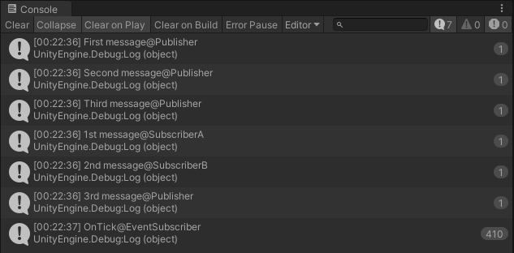

# MessagePipeDemo

## MessagePipeDemo.unity

```cs
using MessagePipe;
using VContainer;
using VContainer.Unity;

namespace MessagePipeDemo
{
    public class GameLifetimeScope : LifetimeScope
    {
        protected override void Configure(IContainerBuilder builder)
        {
            var options = builder.RegisterMessagePipe(/* configure option */);

            builder.RegisterMessageBroker<Message>(options);
            builder.RegisterMessageBroker<MessageKey, Message>(options);

            builder.RegisterEntryPoint<MessageEvent>(Lifetime.Singleton).AsSelf();
            builder.RegisterEntryPoint<MessageEventSubscriber>(Lifetime.Singleton);

            builder.RegisterEntryPoint<MessageSubscriberA>(Lifetime.Singleton);
            builder.RegisterEntryPoint<MessageSubscriberB>(Lifetime.Singleton);
            builder.RegisterEntryPoint<MessagePublisher>(Lifetime.Singleton);
        }
    }
}
```


